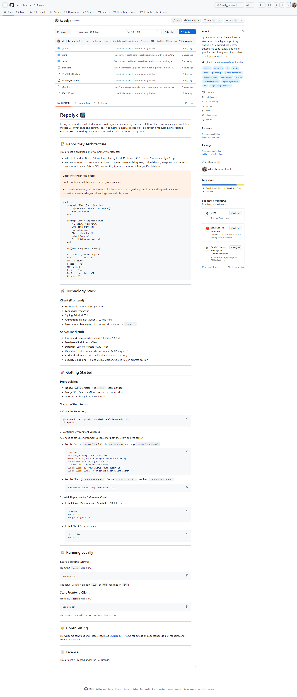
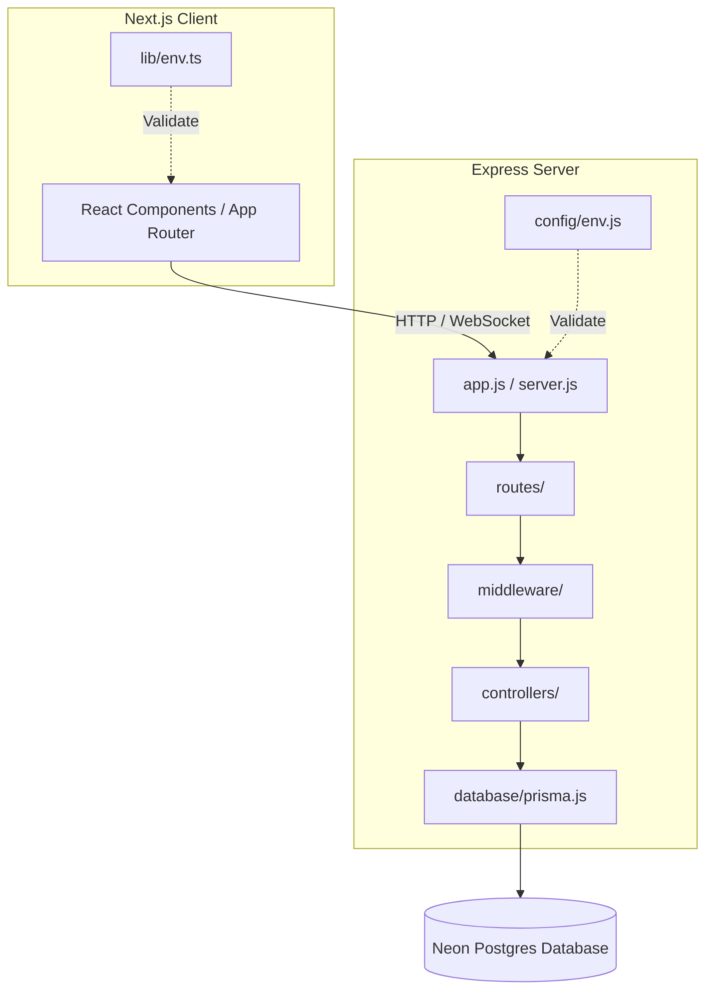

<div align="center">
  
  <h1 align="center">Repolyx</h1>
  <p align="center">
    <strong>AI-Native Engineering Workspace & Developer Intelligence Platform</strong>
  </p>

  <p align="center">
    <a href="https://github.com/rajesh-kayal-dev/Repolyx/stargazers">
      
    </a>
    <a href="https://github.com/rajesh-kayal-dev/Repolyx/network/members">
      
    </a>
    <a href="https://github.com/rajesh-kayal-dev/Repolyx/issues">
      
    </a>
    <a href="https://github.com/rajesh-kayal-dev/Repolyx/pulls">
      
    </a>
    <a href="./LICENSE">
      
    </a>
    <a href="https://github.com/rajesh-kayal-dev/Repolyx/commits/main">
      
    </a>
  </p>

  <p align="center">
    <a href="https://github.com/rajesh-kayal-dev/Repolyx">
      
    </a>
    <a href="https://github.com/rajesh-kayal-dev/Repolyx/issues/new">
      
    </a>
    <a href="https://github.com/rajesh-kayal-dev/Repolyx/issues/new">
      
    </a>
  </p>
</div>

---

## 📖 Table of Contents

- [About](#-about)
- [Features](#-features)
- [Tech Stack](#-tech-stack)
- [Screenshots & Visuals](#-screenshots--visuals)
- [Repository Architecture](#-repository-architecture)
- [Folder Structure](#-folder-structure)
- [Getting Started](#-getting-started)
- [Git Engineering Standards](#-git-engineering-standards)
- [Roadmap](#-roadmap)
- [Contributing](#-contributing)
- [License](#-license)

---

## 💡 About

Repolyx is a modern, full-stack monorepo designed as an industry-standard platform for repository analysis, workflow metrics, AI-driven chat, and security logs. It combines a high-performance **Next.js (TypeScript)** client with a modular, highly scalable **Express (ESM JavaScript)** server integrated with **Prisma ORM** and **Neon PostgreSQL**.

Designed with the developer in mind, it provides immediate repository insights, contribution analysis, and code summary generation in a layout inspired by modern developer products like GitHub, Linear, and Vercel.

---

## ✨ Features

| Feature | Description |
|:---|:---|
| 🤖 **AI Chat** | Intelligent repository-aware assistant for code insights and summaries. |
| 📊 **Contribution Graph** | Live display of real GitHub contributions, streaks, and repository health. |
| 🔍 **Repo Analysis** | Deep codebase insights, file scanning, and dependency graphing. |
| 🔒 **Security Logs** | Audit trails, active sessions monitoring, and session status tracking. |
| 🔑 **GitHub Auth** | Secure OAuth authentication using Passport.js. |
| 🎨 **Modern Dark UI** | Clean, minimalist visual design utilizing React, Tailwind CSS, and Framer Motion. |

---

## 🛠️ Tech Stack

### Frontend
- **Framework**: Next.js 14 (App Router)
- **Language**: TypeScript
- **Styling**: Tailwind CSS
- **Animations**: Framer Motion
- **Icons**: Lucide React
- **Markdown Rendering**: React Markdown, Remark GFM, Rehype Raw

### Backend
- **Server**: Node.js & Express 5 (ESM)
- **Database**: Neon Serverless PostgreSQL
- **ORM**: Prisma ORM
- **Authentication**: Passport.js (GitHub OAuth strategy) & Express Sessions
- **Validation**: Zod (Runtime environment and schema validation)
- **Scraping**: Apify Client (GitHub achievements scraping)

---

## 📸 Screenshots & Visuals

Here is a preview of the main overview page of Repolyx, showcasing the GitHub integration, README renderer, achievements, and repository health metrics:



---

## 🏗️ Repository Architecture

The codebase separates the presentation layer from the database and integration services:



---

## 📂 Folder Structure

```txt
Repolyx/
 ├── .github/
 │    ├── workflows/
 │    │    └── ci.yml             # Automated CI Build & Test Pipeline
 │    └── ISSUE_TEMPLATE/
 │         ├── bug_report.md      # Bug template mapped to needs-triage
 │         └── feature_request.md # Feature template mapped to needs-triage
 ├── client/
 │    ├── app/                   # Next.js pages and routes
 │    ├── components/            # Reusable UI widgets
 │    │    ├── dashboard/        # Dashboard metrics and profile widgets
 │    │    └── ui/               # Primary components (buttons, inputs)
 │    ├── lib/                   # API utilities & providers
 │    ├── public/                # Static brand assets
 │    └── tests/                 # Playwright integration tests
 ├── server/
 │    ├── src/
 │    │    ├── config/           # App settings and environments
 │    │    ├── controllers/      # Route logic handlers
 │    │    ├── routes/           # Express endpoint router definitions
 │    │    ├── middleware/       # Express session and OAuth middlewares
 │    │    ├── services/         # Scrapers and external API services
 │    │    ├── database/         # Prisma client instance configuration
 │    │    └── server.js         # Entry point for backend Express app
 │    ├── prisma/                # Database schema, adapters, and migrations
 │    └── package.json
 ├── docs/                       # Project documentation
 │    ├── assets/                # Screenshots and visuals
 │    └── design/                # PDF specifications and design guidelines
 ├── CLAUDE.md                   # Agent guidelines & commands
 ├── CONTEXT.md                  # Project domain lexicon and maps
 └── README.md                   # This documentation file
```

---

## 🚀 Getting Started

### Prerequisites
- Node.js `v20.x` or later
- Neon PostgreSQL connection string
- GitHub OAuth application credentials

### Step-by-Step Setup

#### 1. Clone the Repository
```bash
git clone https://github.com/rajesh-kayal-dev/Repolyx.git
cd Repolyx
```

#### 2. Configure Environment Variables

**For the Server (`/server/.env`):**
```env
PORT=5000
FRONTEND_URL=http://localhost:3000
DATABASE_URL="your-neon-postgres-connection-string"
JWT_SECRET="your-jwt-signing-secret"
SESSION_SECRET="your-session-secret"
GITHUB_CLIENT_ID="your-github-oauth-client-id"
GITHUB_CLIENT_SECRET="your-github-oauth-client-secret"
```

**For the Client (`/client/.env.local`):**
```env
NEXT_PUBLIC_API_URL=http://localhost:5000
```

#### 3. Install Dependencies & Generate Database Client

```bash
# Server setup
cd server
npm install
npx prisma generate

# Client setup
cd ../client
npm install
```

#### 4. Run Locally

**Start the Server:**
```bash
cd server
npm run dev
```

**Start the Client:**
```bash
cd client
npm run dev
```

Open [http://localhost:3000](http://localhost:3000) to view the application.

---

## 🛠️ Git Engineering Standards

Repolyx is built with rigorous, production-grade git workflows.

### 1. Branch Naming Conventions
Always create a branch for new modifications. Use prefixes to categorise changes:
- `feature/<name>`: For implementing new components or flows (e.g., `feature/github-auth`)
- `fix/<name>`: For bug fixes and regression resolves (e.g., `fix/session-middleware`)
- `refactor/<name>`: For codebase design improvements without feature changes
- `docs/<name>`: For adding or updating documentation

### 2. Commit Message Rules
All commits must follow structured conventional formats:
* `feat: ...` for new features (e.g., `feat: add github oauth integration`)
* `fix: ...` for bug fixes (e.g., `fix: resolve db schema sync mismatch`)
* `refactor: ...` for architectural updates
* `ui: ...` for visual modifications
* `docs: ...` for documentation updates

*Never push directly to the `main` branch. Ensure code is reviewed and Playwright tests pass before merging.*

---

## 🗺️ Roadmap

- [x] Initial full-stack dashboard setup
- [x] GitHub OAuth integration
- [x] Overview page implementation (GitHub profile, contribution heatmap, achievements, repository health)
- [x] Automated CI validation pipeline via GitHub Actions
- [x] Comprehensive Playwright integration test suite
- [ ] Multi-repository sync & comparison dashboard
- [ ] AI-driven auto PR review suggestions
- [ ] Dependency vulnerabilities auditing and alerting

---

## 🤝 Contributing

We welcome contributions! Please review [CONTRIBUTING.md](CONTRIBUTING.md) for details on code quality standards, issue creation, and pull request procedures.

---

## 📄 License

This project is licensed under the ISC License. See the [LICENSE](LICENSE) file for more information.
