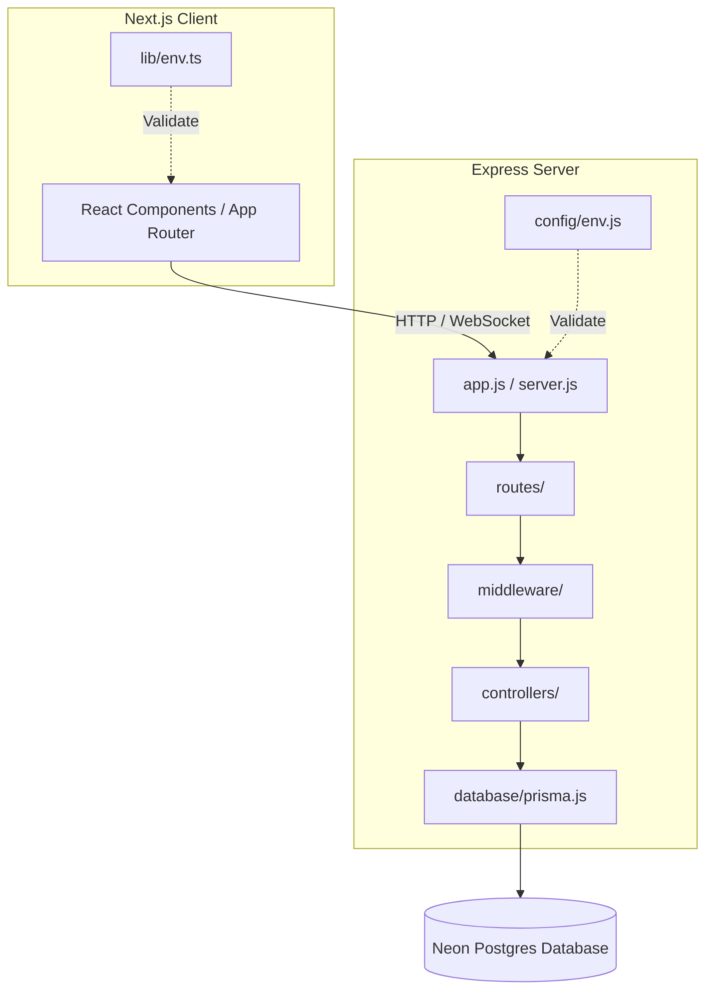

<div align="center">
  
  <h1 align="center">Repolyx ??</h1>
  <p align="center">
    <em>AI-Native Engineering Workspace & Developer Intelligence Platform</em>
  </p>

  <p align="center">
    <a href="https://github.com/rajesh-kayal-dev/Repolyx/stargazers">
      
    </a>
    <a href="https://github.com/rajesh-kayal-dev/Repolyx/network/members">
      
    </a>
    <a href="https://github.com/rajesh-kayal-dev/Repolyx/issues">
      
    </a>
    <a href="https://github.com/rajesh-kayal-dev/Repolyx/pulls">
      
    </a>
    <a href="./LICENSE">
      
    </a>
    <a href="https://github.com/rajesh-kayal-dev/Repolyx/commits/main">
      
    </a>
    <a href="https://github.com/rajesh-kayal-dev/Repolyx">
      
    </a>
    <a href="https://github.com/rajesh-kayal-dev/Repolyx/graphs/contributors">
      
    </a>
  </p>

  <p align="center">
    <a href="https://github.com/rajesh-kayal-dev/Repolyx">
      
    </a>
    <a href="https://github.com/rajesh-kayal-dev/Repolyx/issues/new">
      
    </a>
    <a href="https://github.com/rajesh-kayal-dev/Repolyx/issues/new">
      
    </a>
  </p>
</div>

---

## ?? Table of Contents

- [About](#-about)
- [Features](#-features)
- [Tech Stack](#-tech-stack)
- [Repository Architecture](#-repository-architecture)
- [Getting Started](#-getting-started)
- [Running Locally](#-running-locally)
- [Contributing](#-contributing)
- [License](#-license)
- [GitHub Stats](#-github-stats)
- [Achievements](#-achievements)

---

## ?? About

Repolyx is a modern, full-stack monorepo designed as an industry-standard platform for repository analysis, workflow metrics, AI-driven chat, and security logs. It combines a **Next.js (TypeScript)** client with a modular, highly scalable **Express (ESM JavaScript)** server integrated with **Prisma** and **Neon PostgreSQL**.

---

## ? Features

| Feature | Description |
|---------|-------------|
| ?? **AI Chat** | Intelligent repository-aware assistant for code insights |
| ?? **Workflow Metrics** | Track CI/CD pipelines, PR cycles, deployment frequency |
| ?? **Repo Analysis** | Deep codebase insights, dependency graphs, health checks |
| ??? **Security Logs** | Audit trails, vulnerability scanning, compliance reports |
| ?? **GitHub Auth** | Seamless OAuth integration with Passport.js |
| ?? **Modern UI** | Dark-themed, animated interface with Framer Motion |

---

## ??? Tech Stack

<div align="center">

### Frontend


### Backend


### Tools & Auth


</div>

---

## ??? Repository Architecture

This project is organized into two primary workspaces:

- **`/client`**: A modern Next.js 14 frontend utilizing React 18, Tailwind CSS, Framer Motion, and TypeScript.
- **`/server`**: A robust and structured Express 5 backend server utilising ESM, Zod validation, Passport-based GitHub authentication, and Prisma ORM connecting to a serverless Neon PostgreSQL database.



---

## ?? Getting Started

### Prerequisites

- Node.js `v20.x` or later (Node `v24.x` recommended)
- PostgreSQL Database (Neon instance recommended)
- GitHub OAuth application credentials

### Step-by-Step Setup

#### 1. Clone the Repository

```bash
git clone https://github.com/rajesh-kayal-dev/Repolyx.git
cd Repolyx
```

#### 2. Configure Environment Variables

**For the Server (`/server/.env`):**

```env
PORT=5000
FRONTEND_URL=http://localhost:3000
DATABASE_URL="your-neon-postgres-connection-string"
JWT_SECRET="your-jwt-signing-secret"
SESSION_SECRET="your-session-secret"
GITHUB_CLIENT_ID="your-github-oauth-client-id"
GITHUB_CLIENT_SECRET="your-github-oauth-client-secret"
```

**For the Client (`/client/.env.local`):**

```env
NEXT_PUBLIC_API_URL=http://localhost:5000
```

#### 3. Install Dependencies & Generate Client

```bash
cd server
npm install
npx prisma generate

cd ../client
npm install
```

---

## ?? Running Locally

### Start Backend Server

From the `/server` directory:

```bash
npm run dev
```

The server will start on port `5000` (or `PORT` specified in `.env`).

### Start Frontend Client

From the `/client` directory:

```bash
npm run dev
```

The Next.js client will start on [http://localhost:3000](http://localhost:3000).

---

## ?? Contributing

We welcome contributions! Please check out [CONTRIBUTING.md](CONTRIBUTING.md) for details on code standards, pull requests, and commit guidelines.

---

## ?? License

This project is licensed under the ISC License.

---

## ?? GitHub Stats

<div align="center">

### Contribution Activity


### Contribution Graph


</div>

---

## ?? Achievements

<div align="center">


</div>
