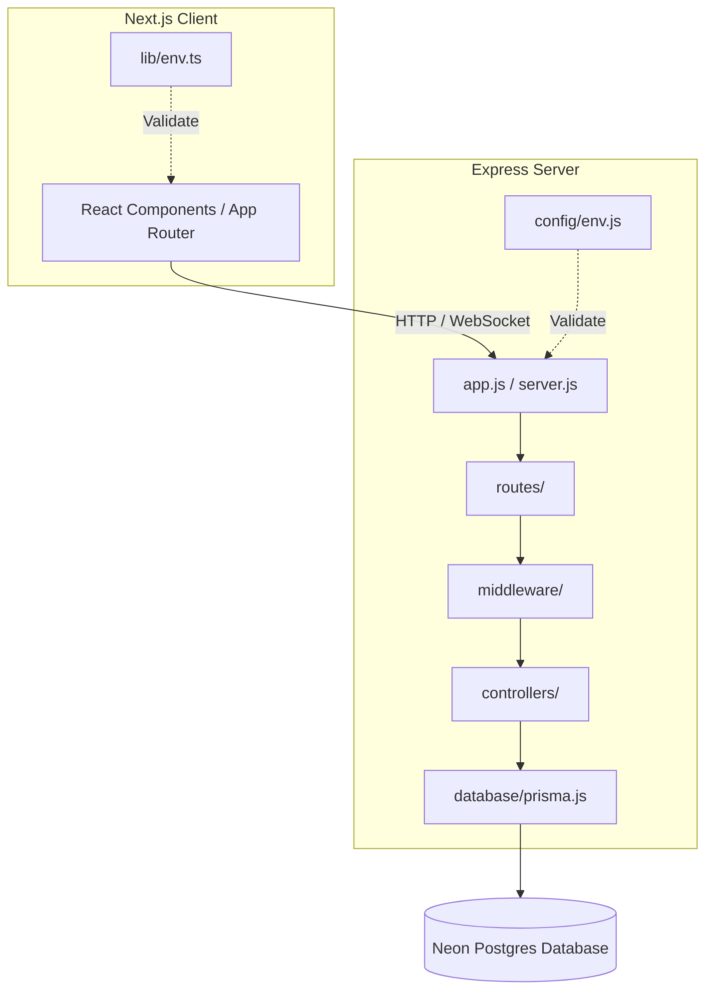

# Repolyx 🌌

Repolyx is a modern, full-stack monorepo designed as an industry-standard platform for repository analysis, workflow metrics, AI-driven chat, and security logs. It combines a Next.js (TypeScript) client with a modular, highly scalable Express (ESM JavaScript) server integrated with Prisma and Neon PostgreSQL.

---

## 🏗️ Repository Architecture

This project is organized into two primary workspaces:
- **/client**: A modern Next.js 14 frontend utilizing React 18, Tailwind CSS, Framer Motion, and TypeScript.
- **/server**: A robust and structured Express 5 backend server utilising ESM, Zod validation, Passport-based GitHub authentication, and Prisma ORM connecting to a serverless Neon PostgreSQL database.



---

## 🛠️ Technology Stack

### Client (Frontend)
- **Framework**: Next.js 14 (App Router)
- **Language**: TypeScript
- **Styling**: Tailwind CSS
- **Animations**: Framer Motion & Lucide Icons
- **Environment Management**: Centralized validation in `lib/env.ts`

### Server (Backend)
- **Runtime & Framework**: Node.js & Express 5 (ESM)
- **Database ORM**: Prisma Client
- **Database**: Serverless PostgreSQL (Neon)
- **Validation**: Zod (Centralized environment & API requests)
- **Authentication**: Passport.js with GitHub OAuth2 Strategy
- **Security & Logging**: Helmet, CORS, Morgan, Cookie-Parser, express-session

---

## 🚀 Getting Started

### Prerequisites
- Node.js `v20.x` or later (Node `v24.x` recommended)
- PostgreSQL Database (Neon instance recommended)
- GitHub OAuth application credentials

### Step-by-Step Setup

#### 1. Clone the Repository
```bash
git clone https://github.com/rajesh-kayal-dev/Repolyx.git
cd Repolyx
```

#### 2. Configure Environment Variables
You need to set up environment variables for both the client and the server.

- **For the Server (`/server/.env`):**
  Create `/server/.env` matching `/server/.env.example`:
  ```env
  PORT=5000
  FRONTEND_URL=http://localhost:3000
  DATABASE_URL="your-neon-postgres-connection-string"
  JWT_SECRET="your-jwt-signing-secret"
  SESSION_SECRET="your-session-secret"
  GITHUB_CLIENT_ID="your-github-oauth-client-id"
  GITHUB_CLIENT_SECRET="your-github-oauth-client-secret"
  ```

- **For the Client (`/client/.env.local`):**
  Create `/client/.env.local` matching `/client/.env.example`:
  ```env
  NEXT_PUBLIC_API_URL=http://localhost:5000
  ```

#### 3. Install Dependencies & Generate Client

- **Install Server Dependencies & Initialize DB Schema:**
  ```bash
  cd server
  npm install
  npx prisma generate
  ```

- **Install Client Dependencies:**
  ```bash
  cd ../client
  npm install
  ```

---

## ⚙️ Running Locally

### Start Backend Server
From the `/server` directory:
```bash
npm run dev
```
The server will start on port `5000` (or `PORT` specified in `.env`).

### Start Frontend Client
From the `/client` directory:
```bash
npm run dev
```
The Next.js client will start on [http://localhost:3000](http://localhost:3000).

---

## 🤝 Contributing

We welcome contributions! Please check out [CONTRIBUTING.md](CONTRIBUTING.md) for details on code standards, pull requests, and commit guidelines.

---

## 📄 License

This project is licensed under the ISC License.
